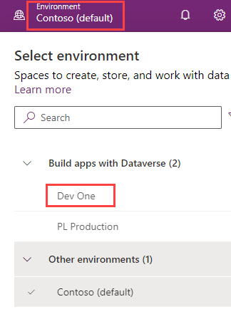

---
lab:
  title: "Laboratorio\_0: Validar el ambiente de laboratorio"
  module: 'Module 0: Course Introduction'
---

# Laboratorio de prácticas 0: Validar el entorno de laboratorio

> **IMPORTANTE:** Este laboratorio proporciona un inquilino de Microsoft 365 y licencias para las aplicaciones de Power Platform que usará en este curso. Solo se le proporcionará un inquilino para los laboratorios de práctica en este curso. Los ajustes y acciones que realice dentro de este inquilino no se revierten ni se reinician, mientras que la máquina virtual que se le proporciona sí se reinicia cada vez que cierra la sesión del laboratorio. Tenga en cuenta que Microsoft 365 y Power Platform están evolucionando todo el tiempo. Las instrucciones en este documento pueden no coincidir con lo que experimente en el inquilino real. También es posible experimentar un retraso de varios minutos antes de que la máquina virtual tenga conectividad de red para comenzar los laboratorios.

## Inquilinos de WWL: términos de uso

Si se te proporciona un inquilino porque estás realizando un curso dirigido por un instructor, ten en cuenta que ese inquilino está disponible únicamente como apoyo para los laboratorios prácticos del curso.

Los inquilinos no deben compartirse ni usarse para otros fines que no sean los de los laboratorios prácticos. El inquilino usado en este curso es un inquilino de prueba y no se puede usar ni tener acceso a él después de que la clase haya terminado y no es apto para la extensión.

Los inquilinos no se deben convertir a suscripciones de pago. Los inquilinos obtenidos como parte de este curso siguen siendo propiedad de Microsoft Corporation y nos reservamos el derecho de acceso y recuperación en cualquier momento.

## Ejercicio 1: Acceso a Microsoft Power Platform

En este ejercicio, comprobará que puede acceder a Power Apps.

### Tarea 1.1: Inicio de sesión en Power Apps

1. Compruebe que tiene las **credenciales de Microsoft 365** del host de laboratorio autorizado disponible. Las credenciales estarán en la pestaña **Recursos**.

1. En una pestaña nueva del explorador, vaya a `https://powerapps.microsoft.com`

1. Seleccione **Iniciar sesión**.

1. Escriba la dirección de correo electrónico proporcionada por el host de laboratorio autorizado.

1. Seleccione **Siguiente**.

1. Escriba la contraseña proporcionada por el host de laboratorio autorizado.

1. Seleccione **Iniciar sesión**.

1. Opcionalmente, seleccione **Sí** para mantener la sesión iniciada.

1. Si se le solicita información de contacto, deje el país o región como valor predeterminado y escriba `0123456789` para Número de teléfono y seleccione **Enviar**.

1. En la parte superior derecha de la pantalla, compruebe que el **Entorno** está establecido en **Dev One**. Aquí es donde trabajará para la totalidad de este laboratorio. Si no es así, seleccione el entorno de **Dev One**.

    
