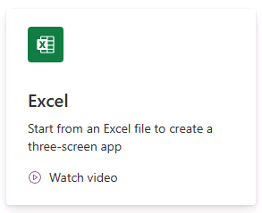
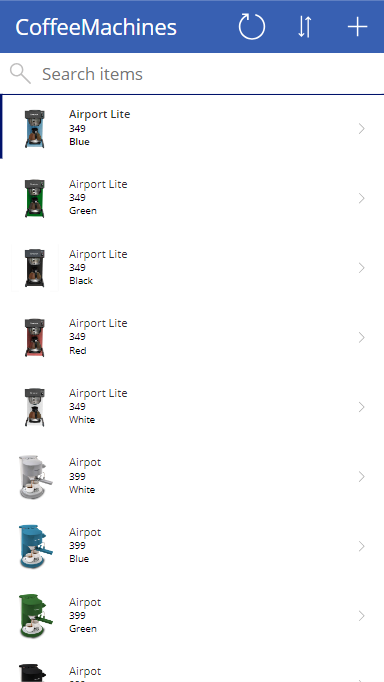

---
lab:
  title: "Laboratorio\_1: Creación de una aplicación de lienzo a partir de datos"
  module: 'Module 1: Get started with Power Apps canvas apps'
---

# Laboratorio de práctica 1: Creación de una aplicación de lienzo a partir de datos

En este laboratorio diseñará y compilará una aplicación de lienzo a partir de un origen de datos existente.

## Aprendizaje

- Creación de aplicaciones de lienzo de Power Apps a partir de datos y con CoPilot
- Cómo conectarse a Excel mediante OneDrive para la Empresa como origen de datos

## Pasos de alto nivel del laboratorio

- Creación de una aplicación de lienzo de tres pantallas
- Prueba de la aplicación
- Creación de una aplicación de lienzo con CoPilot
  
## Requisitos previos

- Debe de haber completado la práctica **Laboratorio 0: Validación del entorno de laboratorio**

## Pasos detallados

## Ejercicio 1: Obtención de los datos

### Tarea 1.1: Descargar la hoja de cálculo de Excel

1. Vaya a [CoffeeMachineData.xlsx](https://github.com/MicrosoftDocs/mslearn-developer-tools-power-platform/blob/master/power-apps/coffee-machine-data/CoffeeMachineData.xlsx).

1. Seleccione el botón de archivo **Raw** (Sin procesar) para descargar el libro de Excel.

    

### Tarea 1.2: Cargar en OneDrive para la Empresa

1. En el [Portal de Power Apps de creador](https://make.powerapps.com), seleccione el **Iniciador de aplicaciones** en la parte superior izquierda de la ventana del explorador y, a continuación, seleccione **OneDrive**.

    

1. Seleccione **Su OneDrive está listo**.

1. Seleccione **+ Agregar nuevo** y, posteriormente, seleccione **Carga de archivos**

    

1. Vaya a Descargas, seleccione el archivo CoffeeMachineData.xlsx y seleccione **Abrir**.

1. Seleccione **Mis archivos** y compruebe que CoffeeMachineData.xlsx se ha cargado.

## Ejercicio 2: Compilación de una aplicación de lienzo de tres pantallas

### Tarea 2.1: Crear la aplicación

1. Vaya al Portal de Power Apps de creador<https://make.powerapps.com>.

1. Asegúrese de que está en el entorno **Dev One**.

1. Seleccione la pestaña **+ Crear** en el menú de la izquierda.

1. Seleccione el icono de **Excel** en **Inicio desde**.

    

1. Seleccione **+ Nueva conexión**

1. Seleccione **OneDrive para la Empresa**, seleccione **Crear**, inicie sesión con sus credenciales de inquilino y seleccione **Permitir acceso**.

1. En Elegir un archivo de Excel, busque y seleccione el archivo de Excel **CoffeeMachineData.xlsx**.

1. En Elegir una tabla, seleccione **CoffeeMachines**.

1. Seleccione **Conectar**.

1. Espere a que se compile la aplicación.

    

1. Si se mostrase el cuadro de diálogo emergente **Bienvenido a Power Apps Studio**, seleccione **No volver a mostrarme** y seleccione **Omitir**.

1. Seleccione **Guardar** en la parte superior derecha de Power Apps Studio, escriba `Coffee Machines App` y seleccione **Guardar**.

### Tarea 2.2: Probar la aplicación

1. Seleccione el icono **Vista previa de la aplicación** en la parte superior derecha de Power Apps Studio.

1. Seleccione cualquier máquina de la galería. Esto le conducirá a la pantalla Detalles.

1. Seleccione el icono **Editar** en la parte superior derecha de la aplicación. Se abrirá la pantalla Editar.

1. Cambie el **Precio de la máquina** y seleccione el icono de tic **Enviar elemento** de la parte superior derecha de la aplicación.

1. Seleccione el icono **<** en la parte superior izquierda de la aplicación.

1. Seleccione el icono **+** en la parte superior derecha de la aplicación.

1. Escriba `97` para **Id. de máquina**.

1. Escriba `Demo Machine` para **Nombre de máquina**.

1. Escriba `999` para **Precio de la máquina**.

1. Seleccione el icono **Enviar elemento** de la parte superior derecha de la aplicación.

1. Escriba `Demo` en **Buscar elementos**.

1. Seleccione **X** en la esquina superior derecha para cerrar la ventana.

1. Si se mostrase el cuadro de diálogo emergente **¿Lo sabía?**, seleccione **No volver a mostrarme** y seleccione **Aceptar**.

1. Seleccione el botón **<- Atrás** en la parte superior izquierda de la barra de comandos y seleccione **Salir** para salir de la aplicación.

## Ejercicio 3: Compilación de una aplicación de lienzo con Copilot

### Tarea 3.1: Crear la aplicación

1. Vaya al Portal de Power Apps de creador<https://make.powerapps.com>.

1. Asegúrese de que está en el entorno **Dev One**.

1. Seleccione la pestaña **Inicio** en el menú de la izquierda.

1. En **Vamos a compilar una aplicación. ¿Qué debe hacer?** escriba `Track coffee machine repairs for customers and assign repairs to technicians` y seleccione el icono de flecha.

    

1. Revisión de la tabla

    

1. Seleccione **Crear aplicación**

1. Espere a que se compile la aplicación.

    

1. Seleccione **Guardar** en la parte superior derecha de Power Apps Studio.

1. Seleccione el botón **<- Atrás** en la parte superior izquierda de la barra de comandos y seleccione **Salir** para salir de la aplicación.

1. Seleccione la pestaña **Aplicaciones** en el menú de la izquierda del portal de Power Apps de creador.
