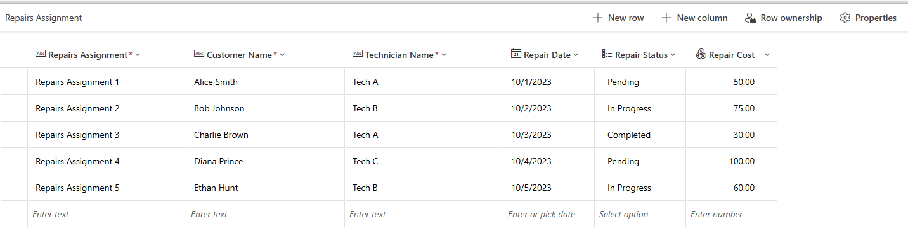

---
lab:
  title: "Laboratorio\_1: Creación de una aplicación de lienzo a partir de datos"
  module: 'Module 1: Get started with Power Apps canvas apps'
---

# Laboratorio de práctica 1: Creación de una aplicación de lienzo a partir de datos

En este laboratorio diseñará y compilará una aplicación de lienzo a partir de un origen de datos existente.

## Aprendizaje

- Creación de aplicaciones de lienzo de Power Apps a partir de datos y con CoPilot
- Cómo conectarse a Excel mediante OneDrive para la Empresa como origen de datos

## Pasos de alto nivel del laboratorio

- Creación de una aplicación de lienzo a partir de los datos
- Pruebas de la aplicación
- Creación de una aplicación de lienzo con CoPilot
  
## Requisitos previos

- Debe de haber completado la práctica **Laboratorio 0: Validación del entorno de laboratorio**

## Pasos detallados

## Ejercicio 1: Obtención de los datos

### Tarea 1.1: Descargar la hoja de cálculo de Excel

1. Vaya a [CoffeeMachineData.xlsx](https://github.com/MicrosoftLearning/PL-7001-Create-and-manage-canvas-apps-with-Power-Apps/blob/master/Allfiles/Labs/CoffeeMachineData.xlsx).

1. Seleccione el botón de archivo **Raw** (Sin procesar) para descargar el libro de Excel.

    

### Tarea 1.2: Cargar en OneDrive para la Empresa

1. En el [Portal de Power Apps de creador](https://make.powerapps.com), seleccione el **Iniciador de aplicaciones** en la parte superior izquierda de la ventana del explorador y, a continuación, seleccione **OneDrive**.

    

1. Si se muestra un elemento emergente, seleccione **Su OneDrive está listo**.

1. Selecciona **+ Crear o actualizar** y, después, selecciona **Cargar archivos**.

    

1. Ve a la carpeta **Descargas**, selecciona el archivo **CoffeeMachineData.xlsx** y selecciona **Abrir**.

1. Seleccione **Mis archivos** y compruebe que CoffeeMachineData.xlsx se ha cargado.

## Ejercicio 2: Creación de una aplicación de lienzo a partir de los datos

### Tarea 2.1: Crear la aplicación

1. Vaya al Portal de Power Apps de creador<https://make.powerapps.com>.

1. Asegúrese de que está en el entorno **Dev One**.

1. Seleccione la pestaña **+ Crear** en el menú de la izquierda.

1. Selecciona el icono **Iniciar con datos** en **Crear las aplicaciones**.

    

1. Selecciona el icono **Conectar datos externos** en **Otras formas de comenzar**.

    

1. Selecciona el icono **Desde Excel** en **Elegir un conjunto de datos para iniciar**.

    

1. Una conexión de **Excel Online (Empresa)** se creará automáticamente después de un breve retraso.

1. Expande **OneDrive para la Empresa** en **Seleccionar la tabla**.

1. Expande **OneDrive**.

1. Expande el archivo Excel **CoffeeMachineData.xlsx**.

1. Selecciona la tabla **CoffeeMachines**.

    

1. Seleccione **Crear aplicación**.

1. Si aparece el cuadro de diálogo emergente **Bienvenido a Power Apps Studio**, seleccione **No volver a mostrarme esto** y seleccione **Omitir**.

1. Espere a que se compile la aplicación.

    

1. Seleccione **Guardar** en la parte superior derecha de Power Apps Studio, escriba `Coffee Machines App` y seleccione **Guardar**.

### Tarea 2.2: Probar la aplicación

1. Selecciona el icono **Vista previa de la aplicación (F5)** en la parte superior derecha de Power Apps Studio.

1. Seleccione cualquier máquina de la galería. Esto muestra los detalles de la máquina en el formulario.

1. Seleccione el icono **Editar** en la parte superior derecha de la aplicación.

1. Cambia el **Precio de la máquina** y selecciona el icono **Tic** en la parte superior derecha de la aplicación.

1. Seleccione el icono **+ Nuevo** en la parte superior izquierda de la aplicación.

1. Escribe `abcde` para Id. de máquina.

1. Escriba `Demo Machine` para **Nombre de máquina**.

1. Escriba `999` para **Precio de la máquina**.

1. Selecciona el icono **Tic** en la parte superior derecha de la aplicación.

1. Seleccione **X** en la esquina superior derecha para cerrar la ventana.

1. Si aparece el cuadro de diálogo emergente **¿Lo sabía?**, seleccione **No volver a mostrarme** y seleccione **Aceptar**.

1. Seleccione el botón **<- Atrás** en la parte superior izquierda de la barra de comandos y seleccione **Salir** para salir de la aplicación.

## Ejercicio 3: Compilación de una aplicación de lienzo con Copilot

### Tarea 3.1: Crear la aplicación

1. Vaya al portal de Power Apps Maker `https://make.powerapps.com`.

1. Asegúrese de que está en el entorno **Dev One**.

1. Seleccione la pestaña **+ Crear** en el menú de la izquierda.

1. Selecciona el **icono Iniciar con Copilot** en **Crear las aplicaciones**.

1. En **Introducción a Copilot**, escribe `Assign coffee repairs to technicians per customer request`.

    

1. Selecciona el icono **Opciones de tabla** y selecciona **Una tabla**.

    

1. Seleccione **Generar**.

    Copilot comenzará a crear una estructura de tabla para admitir la aplicación.

    > **IMPORTANTE:** al usar la Inteligencia artificial generativa, no siempre obtendrás los mismos resultados exactos. Es posible que la tabla no coincida exactamente con la tabla creada para otro alumno.

1. Selecciona **Comandos (...)** junto a la tabla y selecciona **Ver datos**.

    

1. Revisión de la tabla

    

1. Cuando estés satisfecho con la tabla, selecciona el botón **Guardar y abrir aplicación**.

1. Si es necesario, en la pantalla **¿Has terminado de trabajar?**, selecciona **No volver a preguntarme** y, después, selecciona el botón **Guardar y abrir aplicación**.

1. Espere a que se compile la aplicación.

    

1. Seleccione **Guardar** en la parte superior derecha de Power Apps Studio, escriba `Coffee Machine Repairs App` y seleccione **Guardar**.

1. Seleccione el botón **<- Atrás** en la parte superior izquierda de la barra de comandos y seleccione **Salir** para salir de la aplicación.

1. Seleccione la pestaña **Aplicaciones** en el menú de la izquierda del portal de Power Apps de creador.
