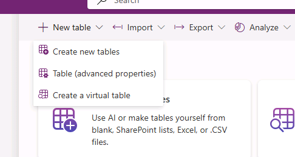
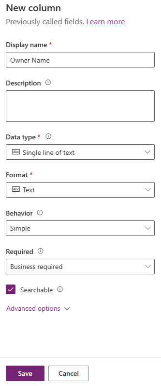

---
lab:
  title: "Laboratorio\_2: Modelo de datos"
  module: 'Module 2: Get started with Microsoft Dataverse'
---

# Laboratorio de práctica 2: Modelo de datos

En este laboratorio creará tablas y columnas de Dataverse.

## Aprendizaje

- Procedimiento para crear tablas y columnas en Microsoft Dataverse
- Procedimiento para crear una relación con una columna de búsqueda

## Pasos de alto nivel del laboratorio

- Crear una tabla personalizada
- Agregar columnas a la tabla
- Creación de una relación mediante una columna de búsqueda
  
## Requisitos previos

- Debe de haber completado la práctica **Laboratorio 0: Validación del entorno de laboratorio**

## Pasos detallados

## Ejercicio 1: Creación de tablas personalizadas

### Tarea 1.1: Creación de la tabla Solicitud de reserva

1. Vaya al portal de Power Apps Maker `https://make.powerapps.com`.

1. Asegúrese de que está en el entorno **Dev One**.

1. Seleccione **Tablas** en el panel de navegación izquierdo.

1. Selecciona **+ Nueva tabla** y elige **Tabla (propiedades avanzadas)**.

    

1. En **Nombre para mostrar**, escriba `Booking Request`.

### Tarea 1.2: Columna principal

1. Selecciona la pestaña **columna principal** situada junto a la pestaña **Propiedades**.

    

1. En **Nombre para mostrar**, escriba `Pet Name`.

1. Seleccione **Guardar**.

### Tarea 1.3: Adición de columnas

1. En el panel de **columnas y datos de Solicitud de reserva**, seleccione **+** para agregar una nueva columna.

    

1. En el panel **Nueva columna**, escriba o seleccione los valores siguientes:

   1. Nombre para mostrar: `Owner Name`
   1. Tipo de datos: **Línea de texto única**
   1. Obligatorio: **Obligatorio para la empresa**

    

1. Seleccione **Guardar**.

1. En el panel de **columnas y datos de Solicitud de reserva**, seleccione **+** para agregar una nueva columna.

1. En el panel **Nueva columna**, escriba o seleccione los valores siguientes:

   1. Nombre para mostrar: `Owner Email`
   1. Tipo de datos: **Línea de texto única**
   1. Formato: **Correo electrónico**
   1. Obligatorio: **Obligatorio para la empresa**

1. Seleccione **Guardar**.

1. En el panel de **columnas y datos de Solicitud de reserva**, seleccione **+** y, en el panel **Nueva columna**, escriba o seleccione los valores siguientes:

   1. Nombre para mostrar: `Start Date`
   1. Tipo de datos: **Fecha y hora**
   1. Obligatorio: **Obligatorio para la empresa**

1. Seleccione **Guardar**.

1. En el panel de **columnas y datos de Solicitud de reserva**, seleccione **+** y, en el panel **Nueva columna**, escriba o seleccione los valores siguientes:

   1. Nombre para mostrar: `End Date`
   1. Tipo de datos: **Fecha y hora**
   1. Obligatorio: **Opcional**

1. Seleccione **Guardar**.

1. En el panel de **columnas y datos de Solicitud de reserva**, seleccione **+** y, en el panel **Nueva columna**, escriba o seleccione los valores siguientes:

   1. Nombre para mostrar: `Cost`
   1. Tipo de datos: **Moneda**
   1. Obligatorio: **Opcional**

1. Seleccione **Guardar**.

1. En el panel de **columnas y datos de Solicitud de reserva**, seleccione **+** y, en el panel **Nueva columna**, escriba o seleccione los valores siguientes:

   1. Nombre para mostrar: `Notes`
   1. Tipo de datos: **Varias líneas de texto**
   1. Formato: **Texto**
   1. Obligatorio: **Opcional**

1. Seleccione **Guardar**.

### Tarea 1.4: Adición de una columna de elección

1. En el panel de **columnas y datos de Solicitud de reserva**, seleccione **+** y, en el panel **Nueva columna**, escriba o seleccione los valores siguientes:

   1. Nombre para mostrar: `Decision`
   1. Tipo de datos: **Opción**
   1. Obligatorio: **Opcional**

1. Seleccione **No** en **¿Sincronizar con opción global?**

1. Escriba `Undecided` en **Etiqueta** y `1` en **Valor**.

1. Seleccione **+ Nueva opción** y escriba `Accepted` en **Etiqueta** y `2` en **Valor**.

1. Seleccione **+ Nueva opción** y escriba `Declined` en **Etiqueta** y `3` en **Valor**.

1. Seleccione **Sin decidir** en **Opción predeterminada**.

    

1. Seleccione **Guardar**.

## Ejercicio 2: Creación de relaciones

### Tarea 2.1: Creación de una columna de búsqueda

1. Vaya al portal de Power Apps Maker `https://make.powerapps.com`.

1. Asegúrese de que está en el entorno **Dev One**.

1. Seleccione **Tablas** en el panel de navegación izquierdo.

1. Seleccione **Solicitud de reserva**.

1. En el panel de **columnas y datos de Solicitud de reserva**, seleccione **+** y, en el panel **Nueva columna**, escriba o seleccione los valores siguientes:

   1. Nombre para mostrar: `Account`
   1. Tipo de datos: **Lookup**
   1. Obligatorio: **Opcional**
   1. Tabla relacionada: **Cuenta**

    

1. Seleccione **Guardar**.

## Ejercicio 3: Datos

### Tarea 3.1: Agregar registros de solicitudes de reserva

1. Vaya al portal de Power Apps Maker <https://make.powerapps.com>.

1. Asegúrese de que está en el entorno **Dev One**.

1. Seleccione **Tablas** en el panel de navegación izquierdo.

1. Seleccione **Solicitud de reserva**.

1. En el panel **Columnas y datos de solicitudes de reserva**, seleccione el símbolo de menú desplegable junto a **Editar** y seleccione **Editar en una nueva pestaña**.

1. Introduzca o seleccione los siguientes valores:

   1. Nombre de la mascota: `Fido`
   1. Nombre del propietario: `MOD Administrator`
   1. Correo electrónico del propietario: Use el correo electrónico del inquilino
   1. Fecha de inicio: **Mañana**
   1. Fecha de finalización: **Elegir una fecha de la semana siguiente**
   1. Coste: `1,000`
   1. Decisión: **Aceptada**

1. Seleccione **Insertar fila debajo** y escriba o seleccione los valores siguientes:

   1. Nombre de la mascota: `Tom`
   1. Nombre del propietario: `MOD Administrator`
   1. Correo electrónico del propietario: Use el correo electrónico del inquilino
   1. Fecha de inicio: **Elegir una fecha del mes siguiente**
   1. Fecha de finalización: **Elegir una fecha después de la fecha de inicio**
   1. Coste: `1,500`
   1. Decisión: **No decidió**

1. Seleccione **Insertar fila debajo** y escriba o seleccione los valores siguientes:

   1. Nombre de la mascota: `Jim`
   1. Nombre del propietario: `MOD Administrator`
   1. Correo electrónico del propietario: Use el correo electrónico del inquilino
   1. Fecha de inicio: **Elegir una fecha futura del mes actual**
   1. Fecha de finalización: **Elegir una fecha después de la fecha de inicio**
   1. Coste: `250`
   1. Decisión: **Rechazada**

1. Cierre la pestaña Editar datos.

