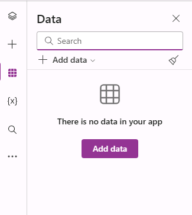

---
lab:
  title: 'Laboratorio 3: Crear una aplicación de lienzo'
  module: 'Module 3: Customize a canvas app in Power Apps'
---

# Laboratorio de prácticas 3: Crear una aplicación de lienzo

En este laboratorio, diseñará y compilará una aplicación de lienzo desde cero, agregará un origen de datos y una galería.

## Aprendizaje

- Cómo crear una aplicación de lienzo con una galería vinculada a un origen de datos
- Cómo dar formato a campos con fórmulas de Power Fx

## Pasos de alto nivel del laboratorio

- Crear una aplicación de lienzo desde cero
- Adición de un origen de datos a la aplicación
- Adición de una galería a la aplicación
- Configuración de los campos en la galería
  
## Requisitos previos

- Debe de haber completado la práctica **Laboratorio 2: Modelo de datos**

## Pasos detallados

## Ejercicio 1: Crear una aplicación de lienzo

### Tarea 1.1: Crear la aplicación

1. Vaya al portal de Power Apps Maker <https://make.powerapps.com>.

1. Asegúrese de que está en el entorno **Dev One**.

1. Seleccione la pestaña **+ Crear** en el menú de la izquierda.

1. Seleccione el icono **Aplicación en blanco** en **Inicio desde**.

    

1. Seleccione **Crear** en el icono **Aplicación de lienzo en blanco**.

1. Escriba `Booking Request app` para **Nombre de aplicación**.

1. Seleccione **Tableta** para **Formato**.

    

1. Seleccione **Crear**.

1. Espere a que se compile la aplicación.

1. Seleccione **Guardar** en la parte superior derecha de Power Apps Studio.

### Tarea 1.2 - Agregar origen de datos

1. En el menú de creación de aplicaciones, seleccione **Datos**.

    

1. Seleccione el símbolo de intercalación desplegable junto a **Agregar datos** y escriba `Booking` en **Buscar**.

    

1. Seleccione **Solicitudes de reserva** Tabla de Microsoft Dataverse.

### Tarea 1.3: Configurar la pantalla principal

1. En el menú de creación de aplicaciones, seleccione **Vista de árbol**.

1. Seleccione **Screen1** en la vista de árbol, después, los puntos suspensivos (**...**) y, luego, **Cambiar nombre**.

1. Escriba `MainScreen`.

1. En el menú de creación de aplicaciones, seleccione **Insertar (+)**.

1. Seleccione **Rectángulo**.

1. Arrastre el rectángulo a la parte superior izquierda de la pantalla.

1. En el menú de creación de aplicaciones, seleccione **Vista de árbol**.

1. Cambie el nombre del rectángulo a `HeaderRect`.

1. Establezca las propiedades del rectángulo de la manera siguiente:

   1. X=`0`
   1. Y=`0`
   1. Altura=`80`
   1. Ancho=`Parent.Width`

1. En el menú de creación de aplicaciones, seleccione **Insertar (+)**.

1. Seleccione **Etiqueta de texto**.

1. Arrastre la etiqueta a la parte superior izquierda de la pantalla.

1. En el menú de creación de aplicaciones, seleccione **Vista de árbol**.

1. Cambie el nombre de la etiqueta a `HeaderLabel`.

1. Establezca las propiedades de la etiqueta de la manera siguiente:

   1. X=`0`
   1. Y=`0`
   1. Altura=`80`
   1. Ancho=`Parent.Width`
   1. Alineación=`Align.Center`
   1. Tamaño=`24`
   1. Texto=`"Booking Request"`
   1. Color=`Color.White`

    

1. Seleccione **Guardar** en la parte superior derecha de Power Apps Studio.

### Tarea 1.4: Agregar una galería

1. En el menú de creación de aplicaciones, seleccione **Insertar (+)**.

1. Seleccione **Galería vertical**.

    

1. Seleccione **Solicitudes de reserva**.

    

1. Seleccione el **título, el subtítulo y el cuerpo** para **Diseño**.

1. Seleccione **7 seleccionado** junto a **Campos.**

1. Seleccione **Costo** para **Cuerpo**.

1. Seleccione **Decisión** para **Subtítulo**.

1. Seleccione **Nombre de la mascota** para **Título**.

    

1. Cerrar el panel Datos.

1. En el menú de creación de aplicaciones, seleccione **Vista de árbol**.

1. Cambie el nombre de la galería a `BookingRequestList`.

1. Establezca las propiedades de la galería de la manera siguiente:

   1. X=`0`
   1. Y=`80`
   1. Altura=`575`
   1. Ancho=`250`

### Tarea 1.5: dar formato al campo de moneda

1. En el menú de creación de aplicaciones, seleccione **Vista de árbol**.

1. Expanda la galería.

1. Seleccione el cuerpo.

    

1. Establezca la propiedad **Text** en la fórmula:

    ```powerappsfl
    Text(Value(ThisItem.Cost), "$#,##0.00")
    ```

1. Seleccione **Guardar** en la parte superior derecha de Power Apps Studio.

1. Seleccione el botón **<- Atrás** en la parte superior izquierda de la barra de comandos y seleccione **Salir** para salir de la aplicación.
