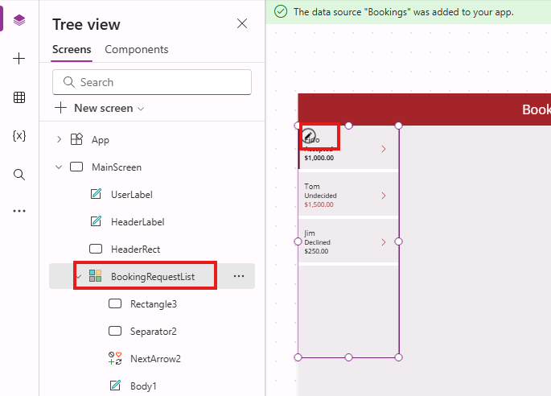

---
lab:
  title: "Laboratorio\_5: Datos externos"
  module: 'Module 5: Work with external data in a Power Apps canvas app'
---

# Laboratorio de prácticas 5: Datos externos

En este laboratorio agregará un origen de datos externo.

## Aprendizaje

- Procedimientos para agregar una lista de SharePoint a la aplicación de lienzo
- Procedimientos para usar colecciones
- Procedimientos para usar revisiones
- Procedimientos para usar el conector Office365Users

## Pasos de alto nivel del laboratorio

- Creación de una lista de SharePoint para reservas
- Incorporación de la lista de SharePoint como una galería
- Almacenamiento de registros seleccionados desde una galería
- Uso de revisiones para establecer la decisión de una solicitud de reserva
- Use el conector Office365User para mostrar los detalles del usuario.
  
## Requisitos previos

- Debe de haber completado la práctica **Laboratorio 4: Compilación de la interfaz de usuario**

## Pasos detallados

## Ejercicio 1: Creación de una lista de SharePoint

### Tarea 1.1 Crear un sitio de SharePoint

1. En el portal de Creadores de Power Apps, `https://make.powerapps.com` seleccione el **Iniciador de aplicaciones** en la parte superior izquierda de la ventana del explorador y, a continuación, seleccione **SharePoint**.

1. Si se muestra la **Página de inicio de bienvenida a SharePoint**, seleccione **✖** para cerrar el cuadro de diálogo.

1. En SharePoint, seleccione **+Crear sitio**.

1. Seleccione **Sitio de grupo**, plantilla de **Equipo estándar** y **Usar plantilla**.

1. Escriba `Pet boarding` para **Nombre del sitio** y seleccione **Siguiente**.

1. Seleccione **Crear sitio**.

1. Seleccione **Finalizar**.

1. Si se muestra el cuadro de diálogo emergente **Inicie el diseño de su sitio**, cierre el cuadro de diálogo.

### Tarea 1.2 Crear una lista de SharePoint

1. En el sitio de SharePoint, seleccione **+ Nuevo** y, a continuación, seleccione **Lista**.

    

1. Selecciona **Lista** en **Crear desde cero**.

1. Escriba `Bookings` en **Nombre** y seleccione **Crear**.

1. Seleccione **+Agregar columna**, seleccione **Texto** y, luego, **Siguiente**.

1. En el panel **Crear una columna**, escriba o seleccione los valores siguientes:

   1. Nombre: `Pet Name`
   1. Tipo de datos: **Línea de texto única**

1. Seleccione **Guardar**.

1. Seleccione **+Agregar columna**, seleccione **Texto** y, luego, **Siguiente**.

1. En el panel **Crear una columna**, escriba o seleccione los valores siguientes:

   1. Nombre: `Owner Name`
   1. Tipo de datos: **Línea de texto única**

1. Seleccione **Guardar**.

1. Seleccione **+ Agregar columna**, seleccione **Fecha y hora** y, luego, **Siguiente**.

1. En el panel **Crear una columna**, escriba o seleccione los valores siguientes:

   1. Nombre: `Start Date`
   1. Tipo de datos: **Fecha y hora**

1. Seleccione **Guardar**.

1. Seleccione **+ Agregar columna**, seleccione **Fecha y hora** y, luego, **Siguiente**.

1. En el panel **Crear una columna**, escriba o seleccione los valores siguientes:

   1. Nombre: `End Date`
   1. Tipo de datos: **Fecha y hora**

1. Seleccione **Guardar**.

1. Copie la primera parte de la dirección URL del sitio de SharePoint, por ejemplo, `https://m365x99999999.sharepoint.com/sites/Petboarding/`

## Ejercicio 2: Incorporación de la lista de SharePoint a la aplicación de lienzo

### Tarea 2.1: Editar la aplicación

1. Vaya al portal de Power Apps Maker `https://make.powerapps.com`.

1. Asegúrese de que está en el entorno **Dev One**.

1. Seleccione la pestaña **Aplicaciones** en el menú de navegación de la izquierda.

1. Seleccione la **aplicación Solicitud de reserva**, los comandos (**...**) y **Editar > Editar en una pestaña nueva**.

### Tarea 2.2: Agregar SharePoint como origen de datos

1. En el menú de creación de aplicaciones, seleccione **Datos**.

1. Seleccione el símbolo de intercalación desplegable junto a **Agregar datos** y escriba `SharePoint` en **Buscar**.

    

1. Seleccione **SharePoint**.

1. Seleccione **Conectar directamente (servicios en la nube)** y **Conectar**.

1. Escriba la dirección URL del sitio de SharePoint que creó anteriormente en este laboratorio.

    

1. Seleccione **Conectar**.

1. Seleccione **Reservas**.

    

1. Seleccione **Conectar**.

### Tarea 2.3: Agregar una galería para la lista de SharePoint

1. En el menú de creación de aplicaciones, seleccione **Insertar (+)**.

1. Seleccione **Galería vertical**.

1. Seleccione **Reservas** para el origen de datos.

1. Seleccione **Título y subtítulo** para **Diseño**.

1. Seleccione **6 seleccionado** junto a **Campos**.

1. Seleccione **Nombre de la mascota** para **Title3**.

1. Seleccione **Fecha de inicio** para **Subtitle3**.

1. Cerrar el panel **Datos**.

1. En el menú de creación de aplicaciones, seleccione **Vista de árbol**.

1. Cambie el nombre de la galería a `BookingList`.

1. Establezca las propiedades de la galería en la barra de fórmulas de la manera siguiente:

   1. X=`1000`
   1. Y=`80`
   1. Altura=`575`
   1. Ancho=`250`

## Ejercicio 3: Colecciones

### Tarea 3.1: Crear una colección

1. En el menú de creación de aplicaciones, seleccione **Vista de árbol**.

1. Expanda **BookingRequestList**.

1. Seleccione **NextArrow**.

1. Establezca la propiedad **OnSelect** de NextArrow en la barra de fórmulas como:

    ```powerappsfl
    Collect(colRequests, ThisItem)
    ```

1. En el menú de creación de aplicaciones, seleccione **Vista de árbol**.

1. Seleccione el objeto **Aplicación**.

1. Establezca la propiedad **OnStart** de la barra de fórmulas como:

    ```powerappsfl
    Clear(colRequests)
    ```

## Ejercicio 4: Revisión

### Tarea 4.1 Rechazar solicitud de reserva

1. En el menú de creación de aplicaciones, seleccione **Vista de árbol**.

1. Seleccione **BookingRequestList**.

1. Seleccione el icono de **lápiz** en la parte superior izquierda del control galería.

    

1. En el menú de creación de aplicaciones, seleccione **Insertar (+)**.

1. Expanda **Iconos**.

1. Seleccione **Bloqueado**. El icono se agregará a cada fila de la galería.

1. Establezca las propiedades del icono en la barra de fórmulas de la manera siguiente:

   1. X=`150`
   1. Y=`40`
   1. Altura=`30`
   1. Ancho=`30`

    

1. En el menú de creación de aplicaciones, seleccione **Vista de árbol**.

1. Cambie el nombre del icono a `DeclineIcon`.

1. Establezca la propiedad **OnSelect** de **DeclineIcon** en la barra de fórmulas como:

    ```powerappsfl
    Patch('Booking Requests', ThisItem, {Decision: 'Decision (Booking Requests)'.Declined})
    ```

## Ejercicio 5: Usuarios de Office 365

### Tarea 5.1 Agregar usuarios de Office 365 como origen de datos

1. En el menú de creación de aplicaciones, seleccione **Datos**.

1. Seleccione el símbolo de intercalación desplegable junto a **Agregar datos** y escriba `Office 365` en **Buscar**.

1. Seleccione **Usuarios de Office 365**.

1. Seleccione **Conectar**.


### Tarea 5.2 Mostrar el país del usuario

1. Seleccione fuera de la galería en el lienzo en blanco, o seleccione la **MainScreen** en la **Vista en árbol**.

1. En el menú de creación de aplicaciones, seleccione **Insertar (+)**.

1. Seleccione **Etiqueta de texto**.

1. Arrastre la etiqueta a la parte superior derecha de la pantalla junto a UserLabel.

1. En el menú de creación de aplicaciones, seleccione **Vista de árbol**.

1. Cambie el nombre de la etiqueta a `UserDetailsLabel`.

1. Establezca la **propiedad Text** de **UserDetailsLabel** en la barra de fórmulas como:

    ```powerappsfl
    Office365Users.MyProfile().Country
    ```

1. Establezca las propiedades de la etiqueta en la barra de fórmulas de la manera siguiente:

   1. X=`930`
   1. Y=`20`
   1. Tamaño=`18`
   1. Color=`Color.White`

1. Seleccione **Guardar** en la parte superior derecha de Power Apps Studio.

1. Seleccione el botón **<- Atrás** en la parte superior izquierda de la barra de comandos y seleccione **Salir** para salir de la aplicación.

