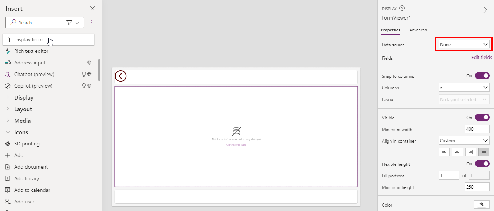
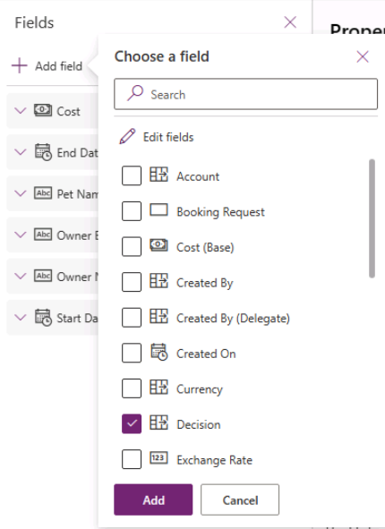
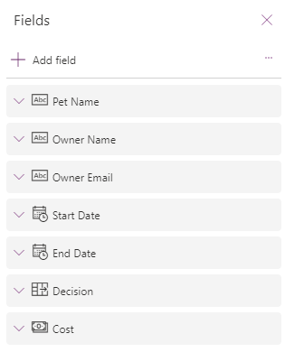

---
lab:
  title: "Laboratorio\_6: Formularios"
  module: 'Module 6: Write data in a Power Apps canvas app'
---

# Laboratorio de práctica 6: Formularios

En este laboratorio, usará formularios para crear y editar registros en un origen de datos.

## Aprendizaje

- Cómo agregar pantallas
- Cómo navegar entre pantallas
- Cómo usar un formulario para crear un registro en un origen de datos
- Cómo usar un formulario para editar un registro en un origen de datos
- Cómo eliminar un registro de un origen de datos
- Cómo vincular un formulario a una galería

## Pasos de alto nivel del laboratorio

- Crear nuevas pantallas
- Vaya a una pantalla cuando se seleccione un registro en una galería
- Navegar entre pantallas
- Mostrar un registro con un formulario
- Eliminar un registro
- Editar un registro con un formulario
- Crear un nuevo registro con un formulario
  
## Requisitos previos

- Debe de haber completado la práctica **Laboratorio 5: Datos externos**

## Pasos detallados

## Ejercicio 1: Adición de pantallas y navegación

### Tarea 1.1: Edición de la aplicación

1. Vaya al portal de Power Apps Maker `https://make.powerapps.com`.

1. Asegúrese de que está en el entorno **Dev One**.

1. Seleccione la pestaña **Aplicaciones** en el menú de navegación de la izquierda.

1. Seleccione la **aplicación Solicitud de reserva**, los comandos (**...**) y **Editar > Editar en una pestaña nueva**.


### Tarea 1.2: Agregar pantallas

1. En el menú de creación de aplicaciones, seleccione **Vista de árbol**.

1. En la barra de acciones de Power Apps Studio, seleccione **Nueva pantalla**.

    

1. Seleccione **En blanco**.

1. Cambie el nombre de la pantalla a `EditScreen`.

1. En la barra de acciones de Power Apps Studio, seleccione **Nueva pantalla**.

1. Seleccione **Encabezado y pie de página**.

1. Cambie el nombre de la pantalla a `DetailScreen`.


### Tarea 1.3: Agregar navegación

1. En la **Vista de árbol**, expanda **BookingRequestList** en **MainScreen**.

1. Seleccione **NextArrow** en **BookingRequestList**.

1. Establezca la propiedad **OnSelect** de NextArrow en la barra de fórmulas como:

    ```powerappsfl
    Collect(colRequests, ThisItem);Navigate(DetailScreen, ScreenTransition.Cover);
    ```

1. Seleccione **EditarScreen**.

1. En el menú de creación de aplicaciones, seleccione **Insertar (+)**.

1. Expanda **Iconos**.

1. Seleccione **Flecha de retroceso**.

1. Establezca la propiedad **OnSelect** del icono en:

    ```powerappsfl
    Back()
    ```

1. En la **vista de árbol**, seleccione el icono y seleccione Comandos (**...**) y seleccione **Copiar**.

1. Expanda **DetailScreen**.

1. Expanda **ScreenContainer**.

1. Seleccione **HeaderContainer** y seleccione Comandos (**...**) y **Pegar**.


## Ejercicio 2: Pantalla Detalles

### Tarea 2.1: Agregar formulario para mostrar

1. En el menú de creación de aplicaciones, seleccione **Vista de árbol**.

1. Expanda **DetailScreen**.

1. Expanda **ScreenContainer**.

1. Seleccione  **MainContainer**.

1. En el menú de creación de aplicaciones, seleccione **Insertar (+)**.

1. Expanda **Entrada**.

1. Seleccione  **Mostrar formulario**.

    

1. En las propiedades de FormViewer, seleccione **Solicitudes de reserva** para **Origen de datos**.

1. Seleccione **2 seleccionado** junto a **Campos**.

    

1. Elimine **Creado el** seleccionando los puntos suspensivos (**...**) junto al campo y seleccionando **Eliminar**.

1. Seleccione **+ Agregar campo** y seleccione los campos siguientes:

   1. Costee
   1. Decisión
   1. Fecha de finalización
   1. Correo electrónico del propietario
   1. Nombre del propietario
   1. Fecha de inicio

    

1. Seleccione **Agregar**.

1. Arrastre los campos en el orden siguiente:

   1. Nombre de la mascota
   1. Nombre del propietario
   1. Correo electrónico del propietario
   1. Fecha de inicio
   1. Fecha de finalización
   1. Decisión
   1. Costee

    

1. **Cierre** el panel **Campos**.

1. Establezca la propiedad **Item** del control del visor de formularios en la barra de fórmulas:

    ```powerappsfl
    BookingRequestList.Selected
    ```

### Tarea 2.2: Agregar etiqueta

1. En el menú de creación de aplicaciones, seleccione **Vista de árbol**.

1. Expanda **DetailScreen**.

1. Expanda **ScreenContainer**.

1. Seleccione  **FooterContainer**.

1. Seleccione  **+** en el contenedor Pie de página.

    

1. Seleccione **Etiqueta de texto**

1. Establezca la propiedad **Text** de la etiqueta en:

    ```powerappsfl
    BookingRequestList.Selected.'Pet Name'
    ```

### Tarea 2.3: agregar botón Eliminar

1. En el menú de creación de aplicaciones, seleccione **Vista de árbol**.

1. Expanda **DetailScreen**.

1. Expanda **ScreenContainer**.

1. Seleccione  **FooterContainer**.

1. En el menú de creación de aplicaciones, seleccione **Insertar (+)**.

1. Seleccione **Botón**.

1. En el menú de creación de aplicaciones, seleccione **Vista de árbol**.

1. Cambie el nombre del botón a `Deletebtn`.

1. Establezca la propiedad **Text** del botón en:

    ```powerappsfl
    "Delete"
    ```

1. Establezca la propiedad **OnSelect** del botón como:

    ```powerappsfl
    Remove('Booking Requests', BookingRequestList.Selected); Back();
    ```

## Ejercicio 3: Editar pantalla

### Tarea 3.1: Agregar formulario de edición

1. En el menú de creación de aplicaciones, seleccione **Vista de árbol**.

1. Seleccione **EditarScreen**.

1. En el menú de creación de aplicaciones, seleccione **Insertar (+)**.

1. Seleccione  **Editar formulario**.

1. En las propiedades del formulario, seleccione **Solicitudes de reserva** para **Origen de datos**.

1. Seleccione **2 seleccionado** junto a **Campos**.

1. Elimine **Creado el** seleccionando los puntos suspensivos (**...**) junto al campo y seleccionando **Eliminar**.

1. Seleccione **+ Agregar campo** y seleccione los campos siguientes:

   1. Costee
   1. Fecha de finalización
   1. Correo electrónico del propietario
   1. Nombre del propietario
   1. Fecha de inicio

1. Seleccione **Agregar**.

1. Arrastre los campos en el orden siguiente:

   1. Nombre de la mascota
   1. Nombre del propietario
   1. Correo electrónico del propietario
   1. Fecha de inicio
   1. Fecha de finalización
   1. Costee

1. **Cierre** el panel **Campos**.

1. Establezca la propiedad **Item** del control de formulario en:

    ```powerappsfl
    BookingRequestList.Selected
    ```

1. En el menú de creación de aplicaciones, seleccione **Vista de árbol**.

1. Cambie el nombre del formulario a `BookingRequestForm`.

1. Establezca las propiedades del formulario de la manera siguiente:

   1. X=`0`
   1. Y=`125`
   1. Altura=`500`
   1. Ancho=`Parent.Width`
   1. Columnas=`1`
   1. Diseño=`Horizontal`

    


### Tarea 3.2: Agregar botón Enviar

1. En el menú de creación de aplicaciones, seleccione **Vista de árbol**.

1. Seleccione **EditarScreen**.

1. En el menú de creación de aplicaciones, seleccione **Insertar (+)**.

1. Seleccione **Botón**.

1. Arrastre el botón debajo del formulario.

1. En el menú de creación de aplicaciones, seleccione **Vista de árbol**.

1. Cambie el nombre del botón a `Submitbtn`.

1. Establezca la propiedad **Text** del botón en:

    ```powerappsfl
    "Submit"
    ```

1. Establezca la propiedad **OnSelect** del botón como:

    ```powerappsfl
    SubmitForm(BookingRequestForm)
    ```

1. Seleccione **BookingRequestForm**.

1. Establezca la propiedad **OnSuccess** del botón en:

    ```powerappsfl
    Navigate(MainScreen, ScreenTransition.UnCover)
    ```

### Tarea 3.3: Agregar navegación a la pantalla de edición

1. En el menú de creación de aplicaciones, seleccione **Vista de árbol**.

1. Expanda **DetailScreen**.

1. Expanda **ScreenContainer**.

1. Seleccione  **HeaderContainer**.

1. En el menú de creación de aplicaciones, seleccione **Insertar (+)**.

1. Expanda **Iconos**.

1. Seleccione **Editar**.

1. En el menú de creación de aplicaciones, seleccione **Vista de árbol**.

1. Cambie el nombre del icono a `EditIcon`.

1. Establezca la propiedad **OnSelect** del icono en:

    ```powerappsfl
    Navigate(EditScreen, ScreenTransition.Cover)
    ```

### Tarea 3.4: Nuevo registro

1. En el menú de creación de aplicaciones, seleccione **Vista de árbol**.

1. Seleccione **MainScreen**.

1. En el menú de creación de aplicaciones, seleccione **Insertar (+)**.

1. Expanda **Iconos**.

1. Seleccione **Agregar**.

1. En el menú de creación de aplicaciones, seleccione **Vista de árbol**.

1. Cambie el nombre del icono a `NewIcon`.

1. Establezca las propiedades del icono de la manera siguiente:

   1. X=`0`
   1. Y=`0`
   1. Altura=`80`
   1. Ancho=`80`
   1. Color=`Color.White`

1. Establezca la propiedad **OnSelect** del icono en:

    ```powerappsfl
    NewForm(BookingRequestForm);Navigate(EditScreen, ScreenTransition.Cover)
    ```

1. Seleccione **Guardar** en la parte superior derecha de Power Apps Studio.

1. Seleccione el botón **<- Atrás** en la parte superior izquierda de la barra de comandos y seleccione **Salir** para salir de la aplicación.

