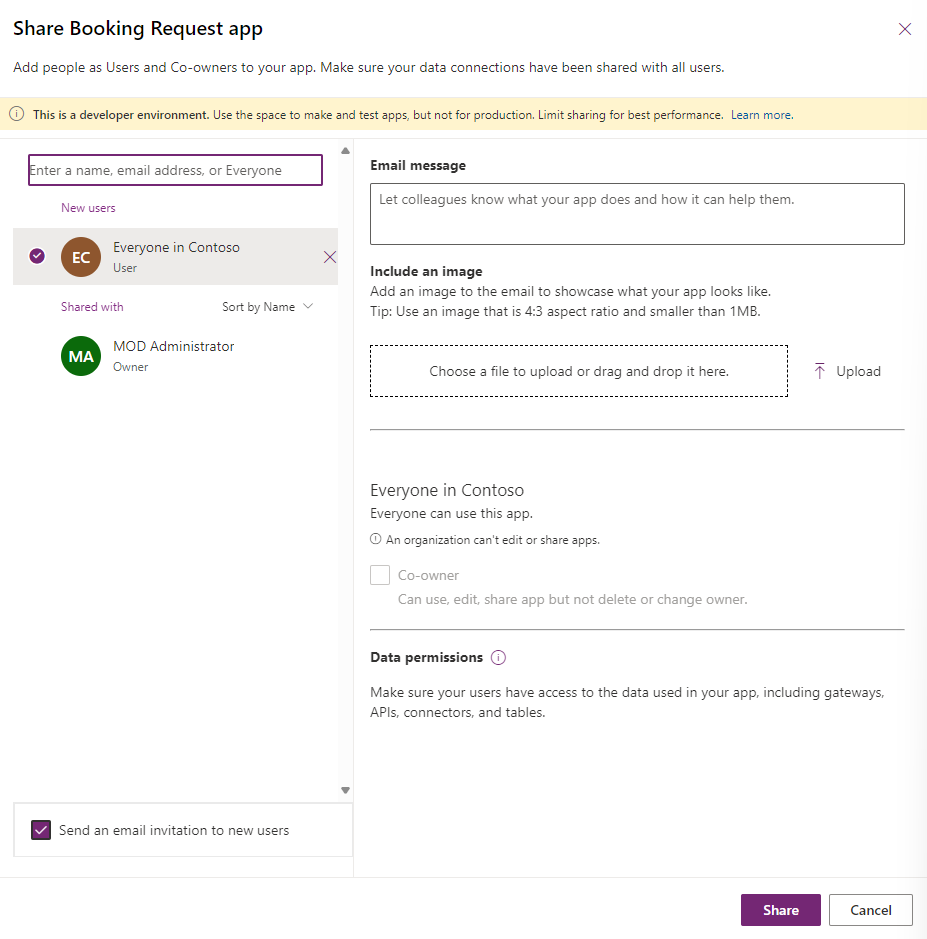
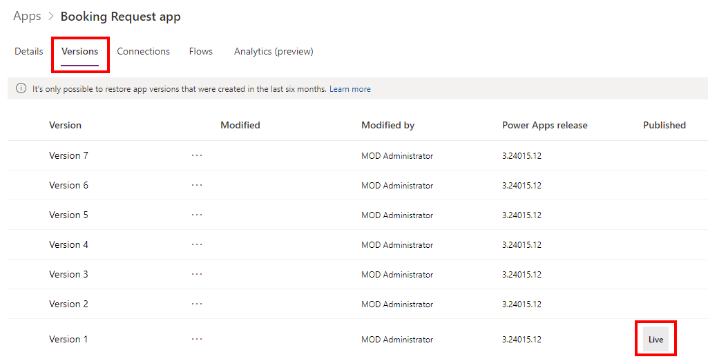

---
lab:
  title: "Laboratorio\_7: Administración de aplicaciones de lienzo"
  module: 'Module 7: Publish, share, and maintain a canvas app'
---

# Laboratorio de práctica 7: Administración de aplicaciones de lienzo

En este laboratorio, administrará la aplicación de lienzo.

## Aprendizaje

- Uso compartido de aplicaciones de lienzo
- Administración de versiones de aplicaciones de lienzo
- Publicación de aplicaciones de lienzo
- Cómo exportar aplicaciones de lienzo

## Pasos de alto nivel del laboratorio

- Compartir una aplicación de lienzo
- Visualización de versiones de la aplicación de lienzo
- Publicación de una aplicación de lienzo
- Exportación de una aplicación de lienzo
  
## Requisitos previos

- Debe de haber completado la práctica **Laboratorio 6: Formularios**

## Pasos detallados

## Ejercicio 1: Administración

### Tarea 1.1: Uso compartido de la aplicación Solicitud de reserva

1. Vaya al portal de Power Apps Maker <https://make.powerapps.com>.

1. Asegúrese de que está en el entorno **Dev One**.

1. En el menú de la izquierda, seleccione la pestaña **Aplicaciones**.

1. Seleccione la **aplicación Solicitud de reserva**, los comandos (**...**) y **Compartir**.

    

1. En el panel Compartir, escriba `Everyone` y seleccione **Todos en Contoso**.

    

1. Seleccione **Compartir**.

1. **Cierre** el panel Compartir aplicación.

### Tarea 1.2: Publicación de la aplicación Solicitud de reserva

1. Seleccione la **aplicación Solicitud de reserva**, los comandos (**...**) y **Detalles**.

1. Seleccione la pestaña **Versiones**.

    

1. Seleccione la versión más reciente.

    

1. Seleccione **Publicar esta versión**.

1. Seleccione **Publicar esta versión** de nuevo.

## Ejercicio 2: Exportación

### Tarea 2.1: Exportación de la aplicación Solicitud de reserva

1. Vaya al portal de Power Apps Maker <https://make.powerapps.com>.

1. Asegúrese de que está en el entorno **Dev One**.

1. En el menú de la izquierda, seleccione la pestaña **Aplicaciones**.

1. Seleccione la **aplicación Solicitud de reserva**, los comandos (**...**) y **Exportar paquete**.

    

1. Escriba `Booking Request app` en Nombre

1. Seleccione **Actualizar** en **IMPORTAR CONFIGURACIÓN**.

1. Seleccione **Crear como nueva** y seleccione **Guardar**.

1. Seleccione **Exportar**.

1. Espere a que se cree y descargue el paquete. Esto crea un archivo ZIP en la carpeta Descargas.

### Tarea 2.2: Guardado local de la aplicación

1. En el menú de la izquierda, seleccione la pestaña **Aplicaciones**.

1. Seleccione la **aplicación Solicitud de reserva**, los comandos (**...**) y **Editar > Editar en una pestaña nueva**.

1. Seleccione el símbolo de intercalación desplegable situado junto a **Guardar** en la parte superior derecha de Power Apps Studio.

1. Seleccione **Descargar una copia**.

1. Seleccione **Descargar**.  Esto crea un archivo msapp en la carpeta Descargas.

1. Seleccione el botón **<- Atrás** en la parte superior izquierda de la barra de comandos y seleccione **Salir** para salir de la aplicación.
